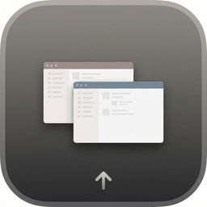

<p align="center">
  
</p>

<h1 align="center">WindowSwitcher</h1>

<p align="center">
  A fast, native macOS window switcher inspired by <a href="https://tabtabapp.net">TabTab</a>.<br>
  Built with SwiftUI. <strong>Powered by <a href="https://manus.im">Manus</a></strong>.
</p>

<p align="center">
  
  
  
  
</p>

---

## Features

**Window Switching** — Quickly switch between all open windows on your Mac with a single keyboard shortcut. Hold Option and press Tab to cycle through windows, release Option to confirm.

**Global App Search** — Type to search not only open windows but also all installed applications on your system. Open windows are prioritized at the top, with matching installed apps listed below. Select any app to launch it instantly.

**Keyboard-First Design** — Every interaction is optimized for keyboard use. Arrow keys navigate the list, Enter activates the selection, Escape dismisses the panel or clears the search, and number keys 1–9 provide instant access to the first nine items.

**Auto Update** — WindowSwitcher checks for new releases on GitHub automatically. When a new version is available, a notification banner appears in the Settings panel with a direct download link.

**Native macOS Experience** — Built entirely with SwiftUI and AppKit, WindowSwitcher integrates seamlessly with macOS. The panel uses a native vibrancy effect and respects your system appearance settings.

## Installation

1. Download the latest `.dmg` from the [Releases](https://github.com/yuzhang9804/WindowSwitcher/releases) page
2. Open the DMG and drag **WindowSwitcher** to your Applications folder
3. Launch WindowSwitcher — it will appear as a menu bar icon
4. Grant **Accessibility** and **Screen Recording** permissions when prompted

## Usage

| Action | Shortcut |
|--------|----------|
| Open switcher | `Option + Tab` |
| Cycle to next window | `Tab` or `↓` |
| Cycle to previous window | `Shift + Tab` or `↑` |
| Activate selected window | Release `Option` or press `Enter` |
| Quick select | `1` – `9` |
| Search windows and apps | Just start typing |
| Clear search | `Escape` |
| Dismiss panel | `Escape` (when search is empty) |

## Settings

WindowSwitcher provides a comprehensive preferences panel accessible from the menu bar icon:

| Section | Options |
|---------|---------|
| **General** | Show menu bar icon, Start at login |
| **Appearance** | Theme (System / Light / Dark), Panel position (Left / Center / Right) |
| **Display** | Choose which screen the panel appears on (shows actual monitor names) |
| **Pinned Apps** | Select apps to pin — the switcher will only cycle through pinned apps; optionally assign per-app trigger keys (A–Z, 0–9) |
| **Hotkeys** | Customize the global keyboard shortcut |
| **About** | Version info, update check, links |

## Tech Stack

| Technology | Purpose |
|------------|---------|
| **Swift 5.9+** | Primary language |
| **SwiftUI** | User interface |
| **AppKit** | System integration (NSPanel, NSVisualEffectView, menu bar) |
| **Accessibility API** | Window enumeration and activation |
| **CGWindowList** | Window information retrieval |
| **KeyboardShortcuts** | Global hotkey management ([sindresorhus/KeyboardShortcuts](https://github.com/sindresorhus/KeyboardShortcuts)) |
| **Sparkle** | Framework integration ([sparkle-project/Sparkle](https://sparkle-project.org/)) |
| **AppSwitcherKit** | Local library for settings storage, app catalog, and pinned app bindings |

## Project Structure

```
WindowSwitcher/
├── Sources/
│   ├── App/
│   │   ├── WindowSwitcherApp.swift    # App entry point
│   │   └── AppDelegate.swift          # Panel management, key monitors
│   ├── Views/
│   │   ├── SwitcherWindow.swift       # Main switcher panel
│   │   ├── SearchField.swift          # Search input component
│   │   ├── ResultsList.swift          # Window/app results list
│   │   ├── ResultItem.swift           # Individual result row
│   │   └── SettingsView.swift         # Preferences window
│   ├── ViewModels/
│   │   ├── SwitcherViewModel.swift    # Switcher logic, global app search
│   │   └── SettingsViewModel.swift    # Settings state management
│   ├── Services/
│   │   ├── WindowService.swift        # Window enumeration & activation
│   │   ├── AccessibilityService.swift # AX API wrapper
│   │   ├── HotkeyService.swift        # Global shortcut handling
│   │   └── UpdateService.swift        # GitHub Release update checker
│   ├── Models/
│   │   ├── WindowInfo.swift           # Window data model
│   │   └── AppInfo.swift              # Application data model
│   └── Utils/
│       └── Extensions.swift           # Shared extensions
├── Resources/
│   └── Info.plist
├── Assets.xcassets/
│   └── AppIcon.appiconset/
└── Libraries/
    └── AppSwitcherKit/                # Local Swift package
```

## Building from Source

```bash
# Clone the repository
git clone https://github.com/yuzhang9804/WindowSwitcher.git
cd WindowSwitcher

# Build with Swift Package Manager
swift build -c release

# Or open in Xcode
open WindowSwitcher.xcodeproj
```

## System Requirements

- macOS 14.0 (Sonoma) or later
- Apple Silicon or Intel Mac
- Accessibility permission required
- Screen Recording permission required (for reading window titles)

## License

MIT License

---

<p align="center"><strong>Powered by <a href="https://manus.im">Manus</a></strong></p>
