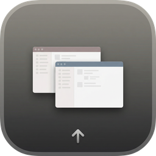

<p align="center">
  
</p>

<h1 align="center">WindowSwitcher</h1>

<p align="center">
  A fast, native macOS window switcher inspired by <a href="https://tabtabapp.net">TabTab</a>.<br>
  Built with SwiftUI. <strong>Powered by <a href="https://manus.im">Manus</a></strong>.
</p>

<p align="center">
  
  
  
  
</p>

---

## Features

**Window Switching** — Quickly switch between all open windows on your Mac with a single keyboard shortcut. Hold the modifier and press Tab to cycle through windows, release it to confirm. Windows on other Spaces and minimized windows are included — switching jumps straight to them.

**⌘+Tab Takeover** — Optionally replace the system app switcher: choose `Command + Tab` in Hotkeys settings and WindowSwitcher intercepts it ahead of macOS (the native switcher is restored when the app quits). The default `Option + Tab` keeps the system switcher untouched.

**Native Switcher Look** — With the Center panel position, the switcher appears as a horizontal icon strip in the middle of the screen, mirroring the native macOS Cmd+Tab switcher — with number badges for quick select and a caption naming the selected window. Left/Right positions show a vertical list panel at the screen edge.

**Global App Search** — Search open windows, window groups, and installed applications — including Finder, Safari, CoreServices apps, user applications, and applications on mounted volumes. Ranking understands exact names, prefixes, substrings, fuzzy matches, bundle IDs, aliases, Pinyin, and Pinyin initials. Press Enter on a result to switch, launch, or restore it.

**Persistent App MRU** — Ordering combines actual application activation history with WindowServer front-to-back order, so switching remains predictable across Spaces, minimized windows, and app relaunches.

**Window Groups** — Record the applications and primary-window positions on a display as a workspace. Activating a group launches missing apps, restores saved geometry, and focuses the first member. Display bindings use stable display UUIDs so monitor reordering does not silently redirect a group.

**Keyboard-First Design** — Arrow keys navigate the list, Right Arrow opens an app's windows, Left Arrow and Escape move back through the hierarchy, and number keys 1–9 provide instant access to the first nine items.

**Update Checks** — WindowSwitcher checks the current GitHub repository for new releases and shows explicit idle, checking, up-to-date, available, and failure states in Settings → About.

**Native macOS Experience** — Built entirely with SwiftUI and AppKit, WindowSwitcher integrates seamlessly with macOS. The panel uses a native vibrancy effect and respects your system appearance settings.

## Installation

1. Download the latest `.dmg` from the [Releases](https://github.com/jakezhang9804/WindowSwitcher/releases) page
2. Open the DMG and drag **WindowSwitcher** to your Applications folder
3. Launch WindowSwitcher — it will appear as a menu bar icon
4. Open Settings → General and grant **Accessibility** and **Screen Recording** access

## Usage

| Action | Shortcut |
|--------|----------|
| Open switcher | `Option + Tab` (or `Command + Tab` when takeover is enabled) |
| Cycle to next window | `Tab` or `↓` |
| Cycle to previous window | `Shift + Tab` or `↑` |
| Activate selected window | Release the modifier; when searching, press `Enter` |
| Quick select | `1` – `9` |
| Activate search | `Enter` (when search is inactive) |
| Open an app's window list | `→` |
| Return from a window list | `←` or `Escape` |
| Deactivate search | `Escape` |
| Dismiss panel | `Escape` at the top level |

## Settings

WindowSwitcher uses a native sidebar settings center accessible from the menu bar and from both switcher layouts:

| Section | Options |
|---------|---------|
| **General** | Live permission status, menu bar icon, start at login, list grouping |
| **Appearance** | Theme (System / Light / Dark), Panel position (Left / Center / Right) |
| **Displays** | Pointer display or a fixed display saved by stable display UUID |
| **Window Groups** | Record, rename, re-record, and delete multi-app window layouts |
| **Keyboard Shortcuts** | `Option + Tab` or `Command + Tab`, plus a full navigation reference |
| **About** | Version info, explicit update states, project link, and Quit |

## Tech Stack

| Technology | Purpose |
|------------|---------|
| **Swift 6.2+** | Primary language and package toolchain |
| **SwiftUI** | User interface |
| **AppKit** | System integration (NSPanel, NSVisualEffectView, menu bar) |
| **CGEventTap** | Primary input path — hotkey interception (incl. ⌘+Tab takeover) and reliable modifier-release detection |
| **Accessibility API** | Window activation and raising |
| **CGWindowList** | Window enumeration across Spaces |
| **SkyLight (private)** | Fronting windows that live on other Spaces |
| **PermissionFlow** | Guided permission onboarding ([jaywcjlove/PermissionFlow](https://github.com/jaywcjlove/PermissionFlow)) |
| **AppSwitcherKit** | Local library for settings storage, app catalog, and window groups |

## Project Structure

```
WindowSwitcher/
├── Sources/
│   ├── App/
│   │   ├── WindowSwitcherApp.swift    # App entry point
│   │   └── AppDelegate.swift          # Panel management, key monitors
│   ├── Views/
│   │   ├── SwitcherWindow.swift       # Main switcher panel
│   │   ├── KeyablePanel.swift         # Non-activating key panel
│   │   └── SettingsView.swift         # Preferences window
│   ├── ViewModels/
│   │   ├── SwitcherViewModel.swift    # Switcher logic, global app search
│   │   └── SettingsViewModel.swift    # Settings state management
│   ├── Services/
│   │   ├── WindowService.swift        # Window enumeration & activation
│   │   ├── AccessibilityService.swift # AX API wrapper
│   │   ├── HotkeyService.swift        # Global shortcut handling
│   │   └── UpdateService.swift        # GitHub Release update checker
│   ├── Models/
│   │   └── WindowInfo.swift           # Window data model
│   └── Utils/
│       ├── DisplayIdentity.swift      # Stable CGDisplay UUID mapping
│       └── L10n.swift                 # Runtime localization (EN/ZH)
├── Resources/
│   └── Info.plist
├── Assets.xcassets/
│   └── AppIcon.appiconset/
└── Libraries/
    └── AppSwitcherKit/                # Settings, app catalog, groups, migrations
```

## Building from Source

```bash
# Clone the repository
git clone https://github.com/jakezhang9804/WindowSwitcher.git
cd WindowSwitcher

# Build with Swift Package Manager
swift build -c release

# Run the AppSwitcherKit and main application test suites
./Scripts/test-all.sh

# Run the debug build
swift run WindowSwitcher
```

### Release signing

Branch and pull-request builds produce **ad-hoc signed development artifacts**. Tag builds also fall back to ad-hoc artifacts and skip the public GitHub Release unless the repository has `MACOS_CERTIFICATE`, `MACOS_CERTIFICATE_PASSWORD`, `KEYCHAIN_PASSWORD`, `APPLE_ID`, `APPLE_APP_SPECIFIC_PASSWORD`, and `APPLE_TEAM_ID` Actions secrets. With all secrets configured, a `vMAJOR.MINOR.PATCH` tag build uses Developer ID, submits the DMG to Apple notary service, staples the ticket to both the app and DMG, and runs Gatekeeper assessment before creating the GitHub Release.

## System Requirements

- macOS 14.0 (Sonoma) or later
- Apple Silicon or Intel Mac
- Accessibility permission required
- Screen Recording permission required (for reading window titles)

> WindowSwitcher uses private SkyLight symbols for cross-Space activation. It is intended for direct distribution rather than the Mac App Store, and cross-Space behavior should be retested on each major macOS release.

## License

MIT License

---

<p align="center"><strong>Powered by <a href="https://manus.im">Manus</a></strong></p>
